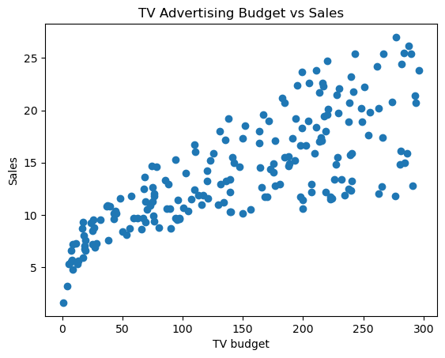
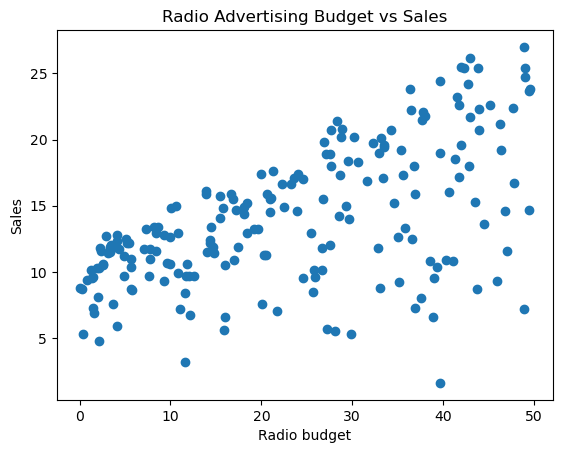
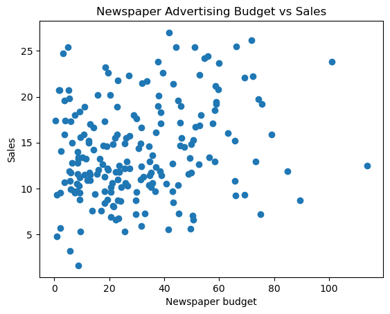
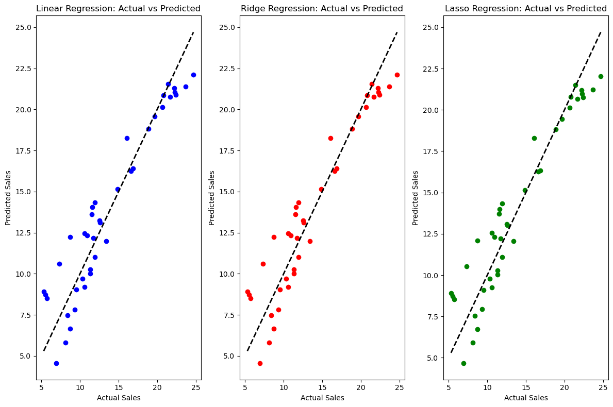

# Advertising Budget vs Sales Analysis

This repository contains code that analyzes the relationship between advertising budgets (TV, Radio, Newspaper) and sales using a dataset from the file `Advertising.csv`. The analysis includes running linear regression, Ridge regression, and Lasso regression to compare how each model performs in predicting sales based on the budget allocated to each channel.

## Requirements

To run this code, you need the following Python libraries:

- `pandas`
- `matplotlib`
- `seaborn`
- `scikit-learn`

You can install these libraries using pip:

```bash
pip install pandas matplotlib seaborn scikit-learn
```

## data
- **TV**: Budget allocated to TV advertising
- **Radio**: Budget allocated to radio advertising
- **Newspaper**: Budget allocated to newspaper advertising
- **Sales**: The sales generated

  ## Code Overview

### 1. Data Loading

- The dataset is loaded into a pandas DataFrame.
- Basic information about the dataset is displayed using `df.info()`.


### 2. Scatter Plot

- A scatter plot is created to visualize the relationship between predictors and Sales.
- Axis labels and a title are added for clarity.

### 3. Regression Analysis

We use **Linear Regression**, **Ridge Regression**, and **Lasso Regression** to model the relationship between the advertising budgets (TV, Radio, Newspaper) and sales.

#### - Linear Regression
We train a simple Linear Regression model to predict `Sales` from `TV`, `Radio`, and `Newspaper` budgets and evaluate its performance using metrics such as **Mean Squared Error (MSE)** and **R-squared**.

#### - Ridge Regression
Ridge Regression is used to introduce regularization to the model, preventing overfitting by penalizing large coefficients. We perform cross-validation to find the optimal regularization parameter (`alpha`).

#### - Lasso Regression
Lasso Regression is another regularization technique that not only prevents overfitting but also performs **feature selection** by forcing some coefficients to be exactly zero. Cross-validation is used to find the optimal `alpha`.
```python
# Example code for training Ridge regression
from sklearn.linear_model import Ridge
ridge_model = Ridge(alpha=best_ridge_alpha)
ridge_model.fit(X_train_scaled, y_train)
```
### 4. Model Comparison

We compare the performance of **Linear Regression**, **Ridge Regression**, and **Lasso Regression** using **Mean Squared Error (MSE)** and **R-squared (R²)** values. The actual vs predicted sales for each model are visualized using scatter plots.

```python
# Predictions for comparison
y_pred_linear = linear_model.predict(X_test_scaled)
y_pred_ridge = ridge_model.predict(X_test_scaled)
y_pred_lasso = lasso_model.predict(X_test_scaled)
```

## Results


---

### 1. Scatter Plot: Predictors vs Sales 

The figures shows a scatter plot visualizing the relationship between predictors and sales for the entire dataset.
- **TV Advertisment Budget vs Sales:**  


- **Radio Advertisment Budget vs Sales:**  


- **Newspaper Advertisment Budget vs Sales:**  



---

### 2. Model Performance Comparison

We trained three models: **Linear Regression**, **Ridge Regression**, and **Lasso Regression** to predict sales based on the advertising budgets for TV, Radio, and Newspaper.

The table below summarizes the **Mean Squared Error (MSE)** and **R-squared (R²)** for each model:

| Model               | MSE     | R-squared (R²) |
|---------------------|---------|----------------|
| Linear Regression   | 3.174   | 0.899          |
| Ridge Regression    | 3.174   | 0.899          |
| Lasso Regression    | 3.14    | 0.900          |

---

### 3. Visualization: Actual vs Predicted Sales

Below are the scatter plots showing the actual vs predicted sales for each regression model:




---


