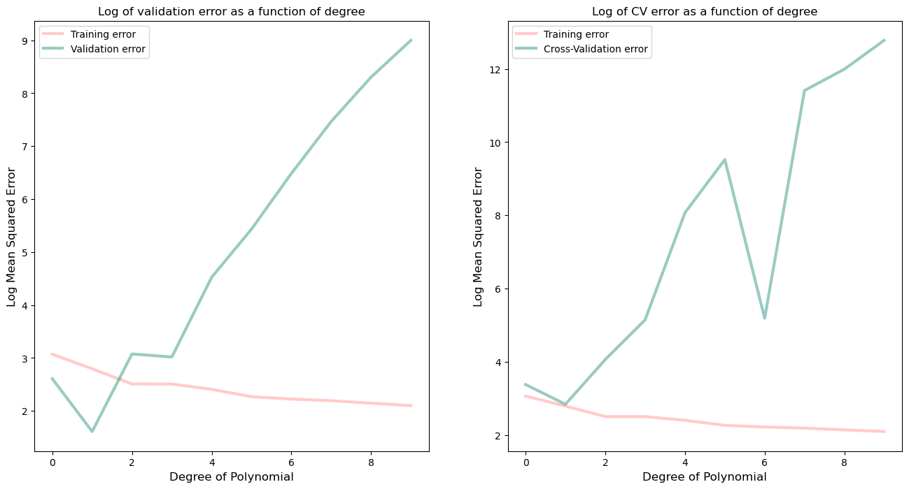

# Polynomial Regression with Cross-Validation

## Overview

This script performs polynomial regression on a dataset and evaluates the performance using Mean Squared Error (MSE) through training, validation, and cross-validation. The objective is to determine the optimal polynomial degree for the regression model and compare results using validation and cross-validation methods.

## Requirements

To run this script, you need the following Python libraries:

- `numpy`
- `pandas`
- `matplotlib`
- `scikit-learn`

You can install these libraries using pip:

```bash
pip install numpy pandas matplotlib scikit-learn
```

## Data
- **x**: Predictor variable.
- **y**: Response variable.

## Script Breakdown

### 1. Library Imports

- Imports necessary libraries and modules.

### 2. Data Loading

- Reads the dataset `dataset.csv` into a pandas DataFrame.
- Extracts predictor (`x`) and response (`y`) variables.

### 3. Train-Validation Split

- Splits the dataset into training (75%) and validation (25%) sets using a fixed random seed (`random_state=1`).

### 4. Polynomial Feature Transformation and Model Training

- Iterates through polynomial degrees from 1 to 10.
- Computes polynomial features and normalizes them.
- Trains a Linear Regression model for each degree.
- Evaluates the model using Mean Squared Error (MSE) on both training and validation sets.
- Performs 10-fold cross-validation and calculates the mean cross-validation error.

### 5. Best Model Selection

- Identifies the polynomial degree with the lowest validation error.
- Identifies the polynomial degree with the lowest cross-validation error.

### 6. Visualization

- Plots MSE vs. polynomial degree for both training and validation sets.
- Plots MSE vs. polynomial degree for cross-validation errors.


## Results

- The script outputs the best polynomial degrees based on validation and cross-validation errors.
- Two plots are generated:
  - A plot of training and validation errors as a function of polynomial degree.
  - A plot of training and cross-validation errors as a function of polynomial degree.

    

