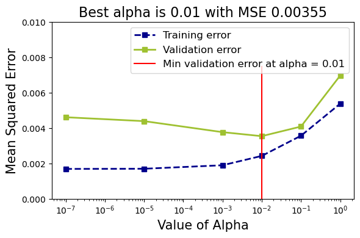
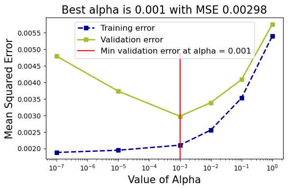

# Polynomial Regression with Ridge Regularization

## Overview
This script performs polynomial regression with Ridge regularization to evaluate the impact of different alpha values on model performance. It compares the effectiveness of regularization using simple validation and cross-validation techniques. The script visualizes the Mean Squared Error (MSE) for different alpha values and identifies the best alpha for each random state.

## Requirements

- `numpy`
- `pandas`
- `matplotlib`
- `prettytable`
- `scikit-learn`

You can install these libraries using pip:

```bash
pip install numpy pandas matplotlib prettytable scikit-learn
```

## Data

The script uses a dataset named `polynomial50.csv`. 
- `x`: Predictor variable.
- `y`: Response variable.
- `f`: True function values for comparison.


## Script Breakdown

1. **Library Imports**:
   - Imports necessary libraries for data manipulation, visualization, and model evaluation.

2. **Data Loading and Visualization**:
   - Reads the dataset `polynomial50.csv` into a pandas DataFrame.
   - Extracts predictor (`x`), response (`y`), and true function (`f`) values.
   - Plots the observed values and true function for visualization.

3. **Regularization with Simple Validation**:
   - Defines a function `reg_with_validation()` that:
     - Splits data into training and validation sets.
     - Applies polynomial feature transformation.
     - Trains Ridge regression models with various alpha values.
     - Computes training and validation MSE for each alpha.
     - Plots MSE vs. alpha and identifies the best alpha based on validation error.

4. **Regularization with Cross-Validation**:
   - Defines a function `reg_with_cross_validation()` that:
     - Samples the data and performs polynomial feature transformation.
     - Trains Ridge regression models with different alpha values.
     - Uses cross-validation to compute training and validation MSE.
     - Plots MSE vs. alpha and identifies the best alpha based on cross-validation error.

5. **Comparison and Reporting**:
   - Compares the best alpha values obtained from simple validation and cross-validation across different random states.
   - Prints a table summarizing the best alpha values for each method and random state.


## Output

- **Plot of MSE vs Alpha (Simple Validation)**: Shows how training and validation errors vary with alpha values, identifying the best alpha for each random state.

  
- **Plot of MSE vs Alpha (Cross-Validation)**: Shows how training and validation errors vary with alpha values using cross-validation, identifying the best alpha for each random state.

  
- **Table of Best Alphas**: Displays a comparison of the best alpha values obtained from simple validation and cross-validation for each random state.

| Random State | Best Alpha with Validation | Best Alpha with Cross-Validation |
|--------------|----------------------------|----------------------------------|
| 0            | 0.01                       | 0.001                            |
| 10           | 1e-05                      | 0.001                            |
| 21           | 0.01                       | 0.001                            |
| 42           | 1                          | 0.001                            |
| 66           | 1e-05                      | 0.001                            |
| 109          | 0.01                       | 0.001                            |

