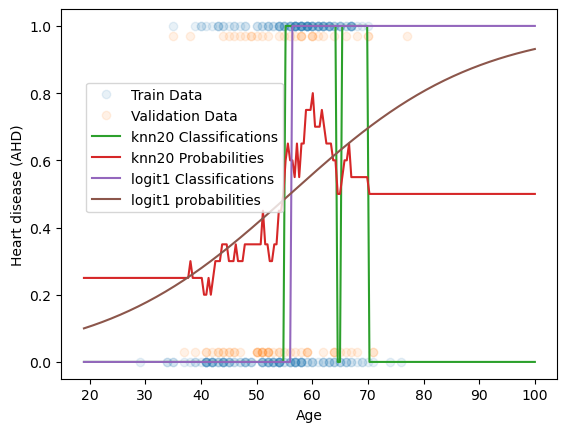
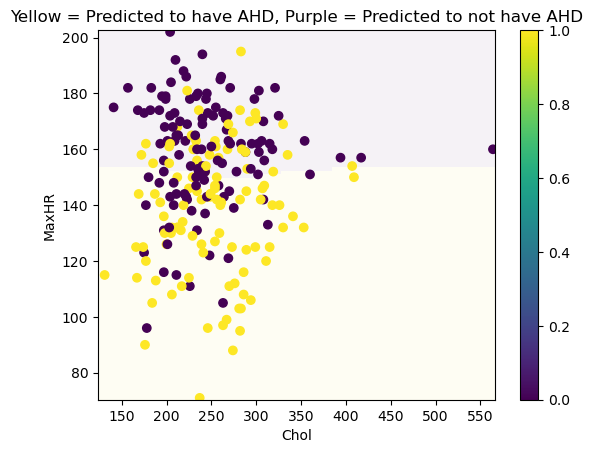

# Heart Disease Prediction Analysis

## Overview

This repository contains code to analyze and predict the presence of heart disease using three different models:
1. **k-Nearest Neighbors (k-NN)**
2. **Logistic Regression**
3. **Polynomial Logistic Regression**

The analysis is based on the `Heart.csv` dataset, which includes various features related to heart health. The goal is to compare the performance of these models in predicting the presence of heart disease.

## Dataset

The `Heart.csv` dataset includes patient data with key columns such as:

- **Age**: Age of the patient
- **Chol**: Cholesterol level
- **MaxHR**: Maximum heart rate achieved
- **AHD**: Presence of heart disease (1 for "Yes", 0 for "No")

## Data Preparation

- The response variable `AHD` is transformed into a binary indicator (1 for "Yes", 0 for "No").
- The dataset is split into training (75%) and validation (25%) sets.

## Models

### 1. k-Nearest Neighbors (k-NN)
- **Model**: `KNeighborsClassifier`
- **Parameter**: `k=20`
- **Training**: The k-NN model is trained on the training set using **age** as the predictor.
- **Predictions**: Generate both classification and probability predictions for the training and validation data.
  
### 2. Logistic Regression
- **Model**: `LogisticRegression`
- **Parameter**: No regularization (`penalty=None`)
- **Training**: The logistic regression model is trained on the training set using **age** as the predictor.
- **Coefficients**: Extract and interpret the coefficients to understand the odds of having heart disease.

### 3. Polynomial Logistic Regression
- **Model**: `LogisticRegression` with polynomial features
- **Features**: Polynomial features of degree 3 are generated for **Chol** and **MaxHR**.
- **Training**: The model is trained on the training set using **Chol** and **MaxHR** as predictors.
- **Prediction**: Classify the presence of heart disease based on the polynomial model.

## Results

### 1. Predictions and Probabilities in Age Analysis

#### k-NN:
- Pure classifications and probability estimates are generated for both training and validation sets.

#### Logistic Regression:
- Coefficient estimates for the logistic regression model are obtained, and the estimated probability of having heart disease is computed for a 60-year-old.  

### 2. Accuracy

The accuracy of both the **k-NN** and **Logistic Regression** models is computed and compared on both the training and validation sets. The **Polynomial Logistic Regression** model is also evaluated for accuracy on the training set.  

| Model                     | Training Accuracy | Validation Accuracy |
|---------------------------|-------------------|---------------------|
| k-Nearest Neighbors (k-NN) | 65%               | 59%                 |
| Logistic Regression        | 63%               | 60%                 |
| Polynomial Logistic Reg.   | 67%               | 65%                 |

### 3. Decision Boundary Visualization (Polynomial Logistic Regression)

The decision boundary of the **Polynomial Logistic Regression** model is visualized using a mesh grid. The plot shows how the model classifies data points based on the polynomial features of **Chol** and **MaxHR**.

### 4. Counterfactual and Sensitivity Analysis

A counterfactual analysis is performed for the **Polynomial Logistic Regression** model:
- Sensitivity to changes in **Chol** and **MaxHR** is analyzed by modifying each predictor by ±0.5 standard deviations.
- The model is found to be more sensitive to changes in **MaxHR** compared to **Chol**.

| Predictor | Change | Number of Prediction Changes |
|-----------|--------|------------------------------|
| **Chol**  | +0.5 SD | 5 changes                    |
| **Chol**  | -0.5 SD | 5 changes                    |
| **MaxHR** | +0.5 SD | 43 changes                    |
| **MaxHR** | -0.5 SD | 53 changes                    |

## Conclusion

This analysis demonstrates the application of three different models to predict heart disease based on the `Heart.csv` dataset:

- **k-Nearest Neighbors (k-NN)**: 
  - Achieved better training accuracy compared to logistic regression.
  - However, it performed worse in terms of validation accuracy, indicating potential overfitting on the training data.

- **Logistic Regression**: 
  - Provided a good balance between training and validation accuracy.
  - It serves as a reliable model for heart disease prediction with reasonable performance on both training and validation sets.

- **Polynomial Logistic Regression**:
  - Outperformed the other models in terms of training accuracy, showcasing its capability to capture complex relationships in the data.
  - Despite this, its validation accuracy was around 65%, highlighting the intricate and multifactorial nature of heart disease.

The polynomial logistic regression model, while providing the best performance in training, shows that predicting heart disease remains challenging due to the complex interactions between features like **Chol** and **MaxHR**.

