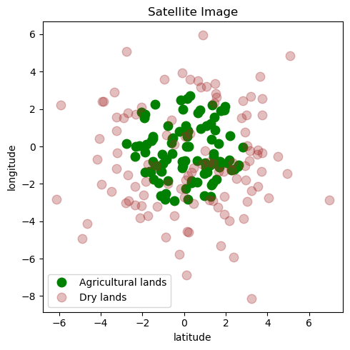
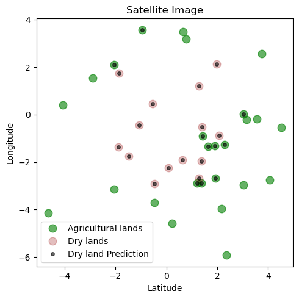
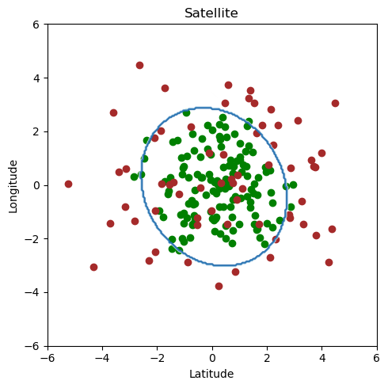

# Land Type Classification with Logistic Regression

## Overview

This repository contains code for classifying land types into agricultural and dry lands using logistic regression with polynomial features. The analysis uses the `land_type.csv` dataset, which includes latitude and longitude information for land areas.

## Dataset

The dataset `land_type.csv` contains:

- **latitude**: Latitude of the land area
- **longitude**: Longitude of the land area
- **land_type**: Binary classification of land type (1 for agricultural lands, 0 for dry lands)

## Analysis

### Data Visualization

- The dataset is visualized to show the distribution of land types based on latitude and longitude. The plot differentiates between agricultural and dry lands.

 

### Model Training and Evaluation

1. **Logistic Regression**:
   - A logistic regression model is trained using polynomial features of degree 10.
   - The regularization parameter `C` is set to $10^{-5}$.
   - The model is trained and validated on split datasets.

2. **Accuracy Calculation**:
   - The accuracy of the model on the validation dataset is calculated. An accuracy of **75%** was reached.
   - A plot visualizes the predictions versus actual values, highlighting correct and incorrect classifications.
   
   

### Boundary Visualization

- For illustrative purposes, a randomly generated Gaussian dataset is used.
- Polynomial logistic regression is applied to visualize decision boundaries with different degrees of polynomial features and regularization values.

 

  

  
