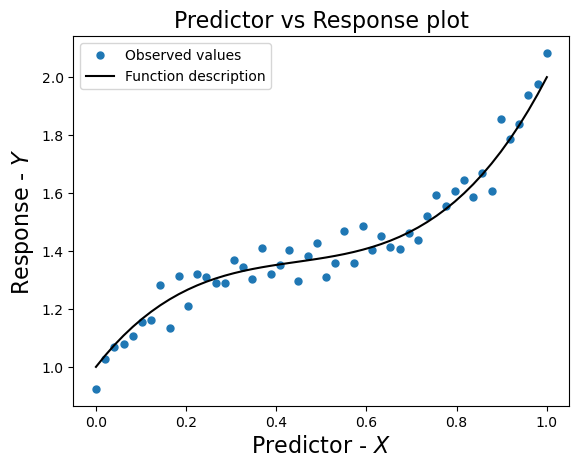
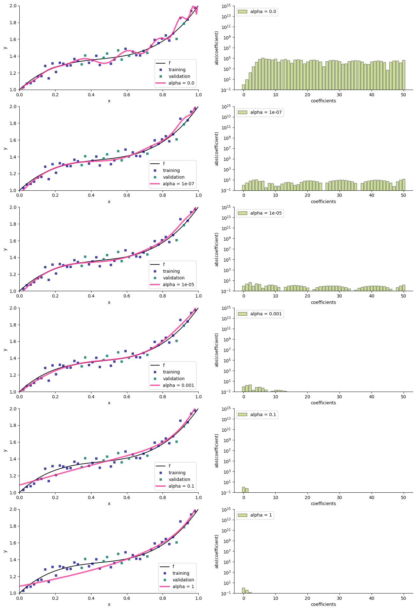
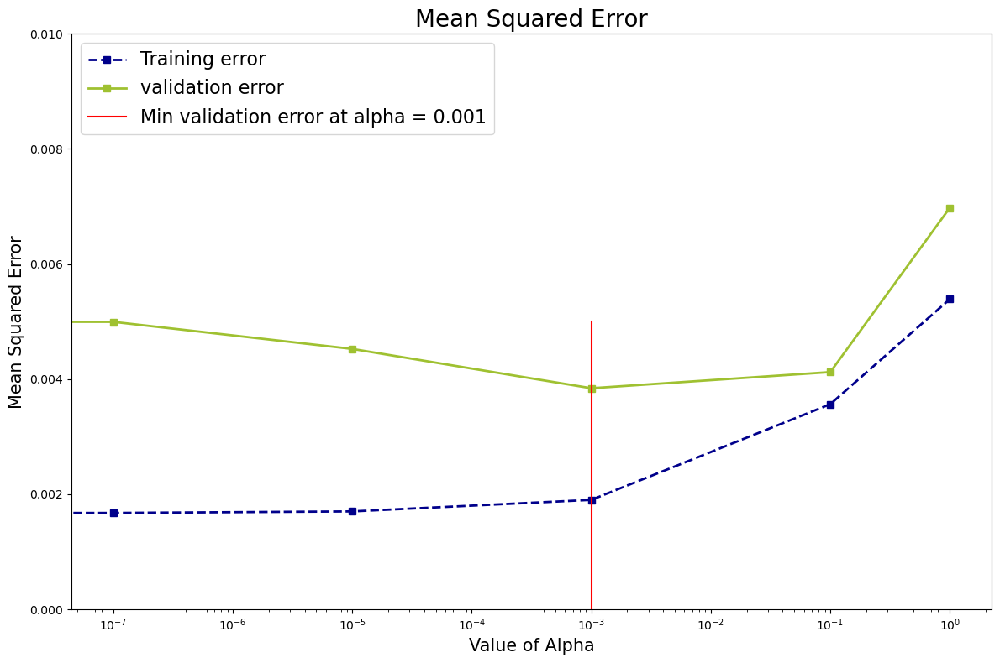

# Polynomial Regression with Ridge Regularization and Hyperparameter Tuning

## Overview

This script performs polynomial regression with Ridge regularization and visualizes the impact of different alpha values on model performance. The script:

- Loads and visualizes the dataset.
- Splits data into training and validation sets.
- Trains Ridge regression models with various alpha values.
- Evaluates the models' performance based on training and validation errors.
- Identifies the best alpha based on validation error.
- Provides visualizations for model performance and coefficient trends.

## Requirements

Ensure you have the following Python libraries installed:

- `numpy`
- `pandas`
- `matplotlib`
- `seaborn`
- `scikit-learn`

You can install these libraries using pip:

```bash
pip install numpy pandas matplotlib seaborn scikit-learn
```


## Data

The script uses a dataset named `polynomial50.csv`. The dataset should contain:

- `x`: Predictor variable.
- `y`: Response variable.
- `f`: True function values for comparison.


## Script Breakdown

1. **Library Imports**:
   - Imports necessary libraries for data manipulation, visualization, and model evaluation.
   - Imports custom helper functions for plotting.

2. **Data Loading and Visualization**:
   - Reads the dataset `polynomial50.csv` into a pandas DataFrame.
   - Extracts predictor (`x`), response (`y`), and true function (`f`) values.
   - Plots the observed values and true function for visualization.  

       

3. **Data Splitting**:
   - Splits the data into training and validation sets with 80% for training and 20% for validation using a fixed random state.

4. **Model Training and Error Calculation**:
   - Defines a range of alpha values for Ridge regularization.
   - Trains Ridge regression models with polynomial features of degree 50 for each alpha.
   - Computes training and validation Mean Squared Error (MSE) for each model.
   - Uses custom plotting functions to visualize model predictions and coefficient trends.

     

5. **Hyperparameter Selection**:
   - Identifies the best alpha value based on the minimum validation MSE.
   - Plots MSE against alpha values for both training and validation errors.
   - Draws a vertical line at the best alpha value for visual reference.
  
     


## Output
- **Plot of Predictor vs Response**: Visualizes the observed values and the true function.


