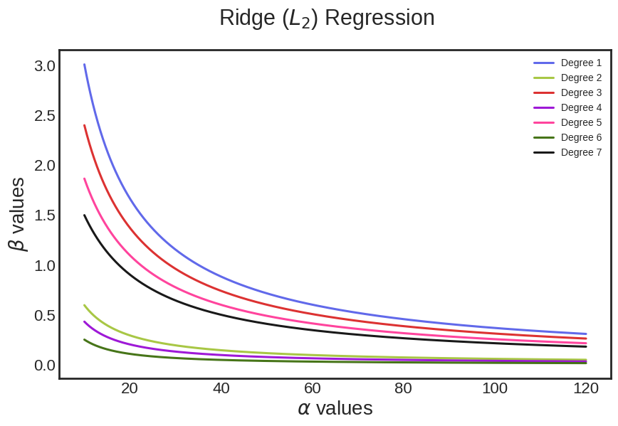
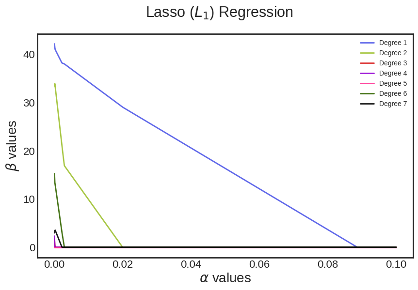
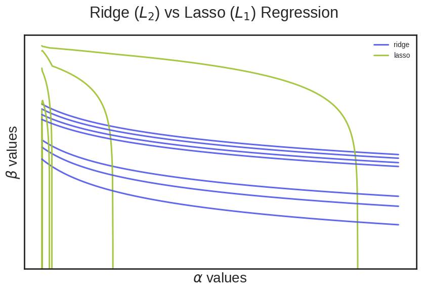

# Ridge and Lasso Regression Analysis

## Overview

This script performs Ridge and Lasso regression on a dataset to compare the effect of regularization on polynomial regression coefficients. It visualizes how different alpha values affect the coefficients of polynomial features for Ridge and Lasso regularizations.

## Requirements

Ensure you have the following Python libraries installed:

- `pandas`
- `numpy`
- `matplotlib`
- `scikit-learn`

You can install these libraries using pip:

```bash
pip install pandas numpy matplotlib scikit-learn
```

## Data

The script uses a dataset named `bacteria_train.csv`.
- `Spreading_factor`: Predictor variable.
- `Perc_population`: Response variable.

  ## Script Breakdown

1. **Library Imports**:
   - Imports necessary libraries including data manipulation, visualization, and machine learning modules.

2. **Data Loading**:
   - Reads the dataset `bacteria_train.csv` into a pandas DataFrame.
   - Extracts predictor (`x`) and response (`y`) variables from the DataFrame.

3. **Polynomial Feature Transformation**:
   - Transforms the predictor variable into polynomial features up to a maximum degree (`maxdeg = 7`).
   - Normalizes the polynomial features to have mean 0 and variance 1.

4. **Ridge Regression Analysis**:
   - Iterates over a range of alpha values (from 10 to 120).
   - Computes Ridge regression coefficients for each alpha value.
   - Plots the variation of Ridge coefficients as a function of alpha values.

     

5. **Lasso Regression Analysis**:
   - Iterates over a range of alpha values (from 1e-4 to 1e-1).
   - Computes Lasso regression coefficients for each alpha value.
   - Plots the variation of Lasso coefficients as a function of alpha values.
     
     

6. **Comparison of Ridge and Lasso**:
   - Compares Ridge and Lasso regression by plotting the coefficients for both methods on the same plot.
   - Uses a logarithmic scale to highlight differences in how Ridge and Lasso shrink coefficients.
     
     

  ## Conclusion

Lasso regression serves as an effective feature selection method by enforcing sparsity in the model coefficients. Unlike Ridge regression, which applies a penalty proportional to the square of the coefficients and thus tends to shrink all coefficients towards zero, Lasso regression utilizes an \(L_1\) penalty that can force some coefficients to be exactly zero. This property of Lasso regression makes it particularly useful for identifying and retaining only the most influential features from a dataset. As the regularization parameter (alpha) increases, Lasso regression increasingly sparsifies the coefficients, leading to a model that is not only simpler but also potentially more interpretable. The comparison of Ridge and Lasso coefficients illustrates how Lasso's \(L_1\) penalty contributes to a more compact model by zeroing out less important features, thus aiding in feature selection and reducing model complexity.


